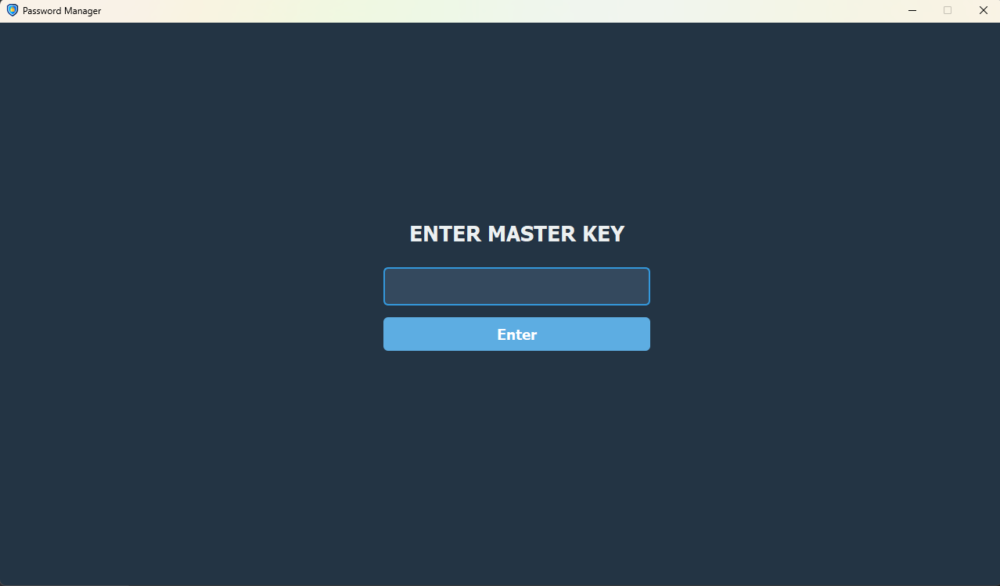
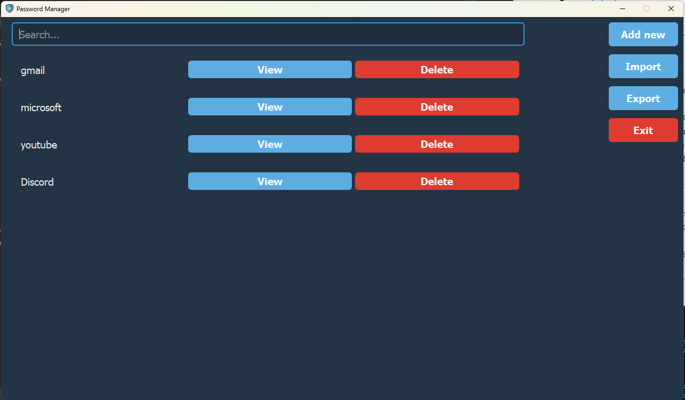

# Password Manager 

## Description

A secure, standalone desktop application for local password storage. Developed using Python 3.12 and Qt Designer (compatible with Python 3.10+).  
All password data is encrypted locally using a master key that the user provides upon initial setup. The application does not require an internet connection and performs all cryptographic operations offline.

**UI Design**: [ndmytryshyn5](https://github.com/ndmytryshyn5)  
**Python Logic**: [os3k1mtr1l](https://github.com/os3k1mtr1l)

---

## Functionality

- Local master-key–protected encrypted password storage (AES-GCM)
- User-friendly graphical interface (PyQt5)
- Secure password creation, editing, and deletion
- Search functionality with live filtering
- Export and import of encrypted database files (`*.pwddb`) with signature verification (`PW!`)
- Protection from incorrect decryption via verify-token system
- Automatic logout after inactivity (session timeout)
- Record filtering and search by keyword
- Secure clipboard copy
- Portable executable build with Nuitka




---

## Requirements

All dependencies are listed in [requirements.txt](requirements.txt)

- Python 3.12+
- pip 3.12+
- [PyQt5](https://pypi.org/project/PyQt5/)
- [SQLAlchemy](https://pypi.org/project/SQLAlchemy/)
- [SQLite](https://www.sqlite.org/)
- [cryptography](https://pypi.org/project/cryptography/) — AES-GCM, PBKDF2
- [Nuitka](https://nuitka.net/) — for binary builds

---

## Building

Project can be compiled into a standalone executable with [build.bat](build.bat) using Nuitka.

```bat
nuitka main.py ^
  --standalone ^
  --onefile ^
  --windows-icon-from-ico=icon.ico ^
  --enable-plugin=pyqt5 ^
  --include-package=src ^
  --output-dir=build ^
  --windows-disable-console
```

---

## License
Codebase: [License](LICENSE)
Icon used in the application: [Security icon by Freepik - Flaticon](https://www.flaticon.com/free-icons/security)